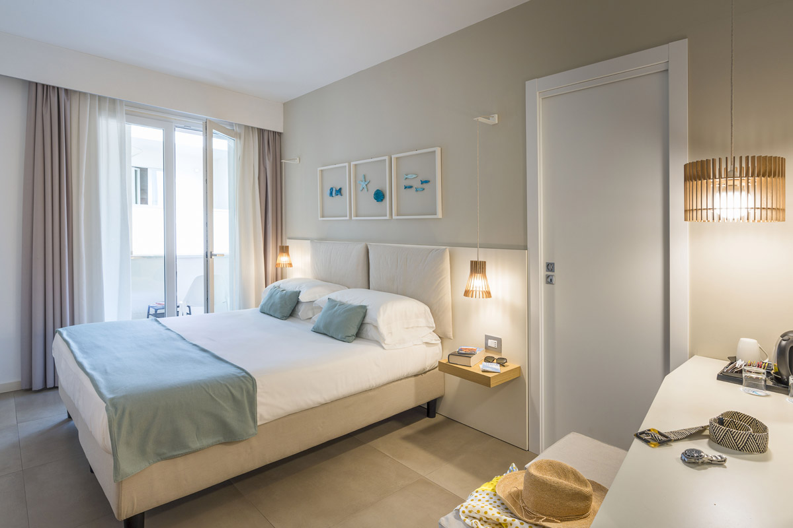
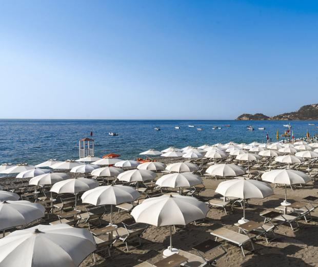
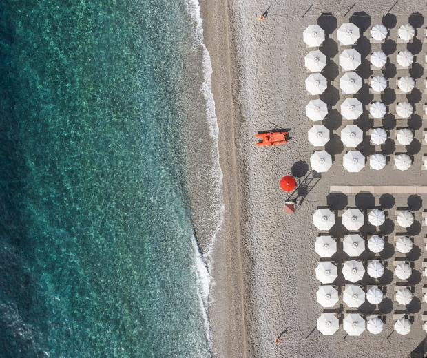
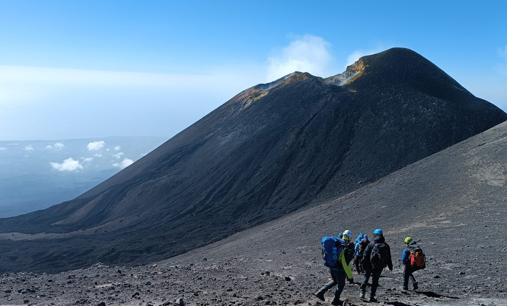
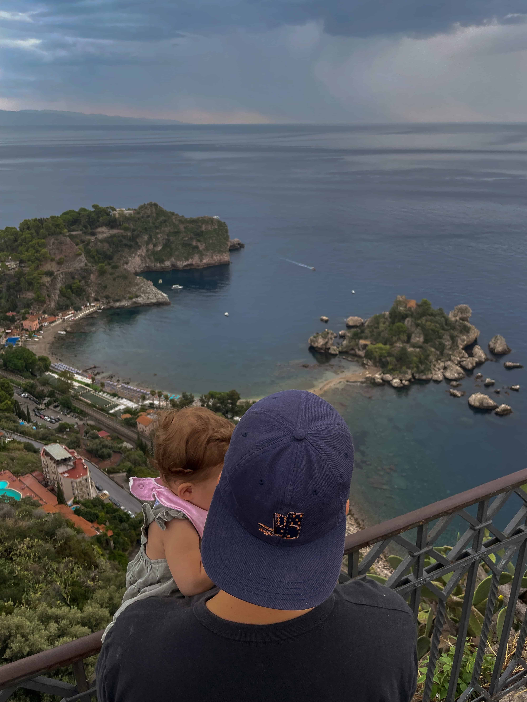
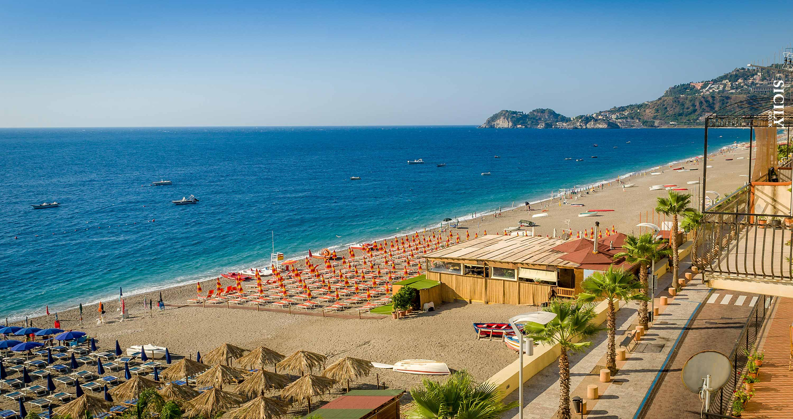
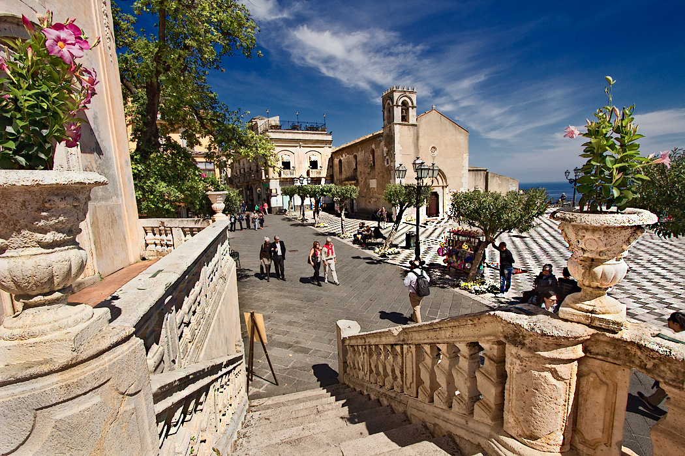
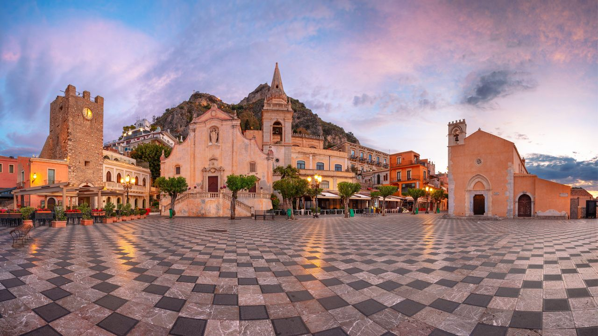
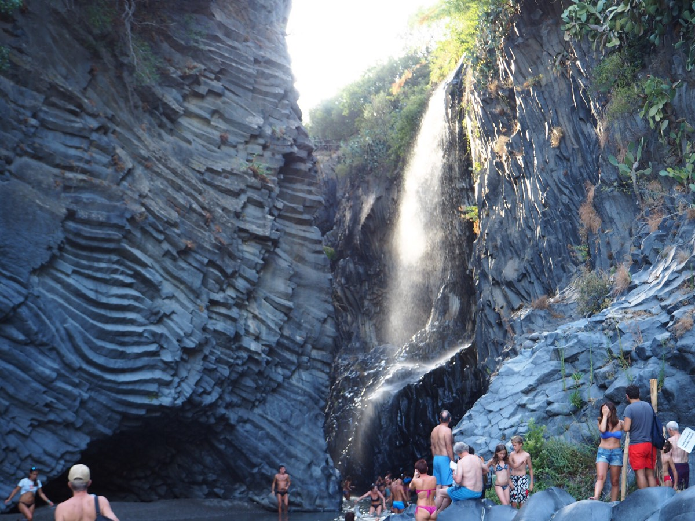

# 🌋 Sicily Trip Guide — Taormina

A complete travel plan for an adventurous and romantic getaway in **Taormina, Sicily** 🇮🇹

---

## 📅 Best Time to Travel
- **Early September** ☀️  
  - Warm weather (25–30°C)
  - Fewer crowds than peak season
  - Perfect for both beaches and hiking

---

## ✈️ Flights

- **From:** Cluj-Napoca  
- **To:** Catania (CTA)

**Estimated cost (2 people):**
- ✈️ 1x Flight (with 20kg luggage): **110€**
- ✈️ 1x Flight (no luggage): **45€**

👉 **Total flights: 155€ (2 people)**

---

## 🚗 Transport

### Car Rental (Recommended ⭐)
- 🚗 Rental: **150€**
- ⛽ Fuel: **50€**

👉 **Total car cost: 200€**

**Why rent a car?**
- Public transport is limited after **21:00**
- Full flexibility for:
  - 🌋 Mount Etna
  - 🏖️ Beaches
  - 🏞️ Scenic drives

**Rental website:**
- https://www.autoeurope.eu/

> ℹ️ Alternative: buses (Etna Transporti), but not ideal for late travel

---

## 💰 Total Transport Cost

| Type        | Cost |
|------------|------|
| Flights    | 155€ |
| Car + Fuel | 200€ |
| **Total**  | **355€ (2 people)** |

---

## 🏨 Accommodation

- **Hotel:** [Albatros Beach Hotel](https://www.hotel-albatros.it/en/)
- **Total cost:** **1500€**
- Includes:
  - 🍳 Breakfast
  - 🍽️ Dinner

---

## 🧭 Things To Do

### 1. 🌋 Etna Summit Trekking
- 🔗 https://www.getyourguide.com/catania-l258/etna-summit-craters-trekking-with-volcano-guide-3350mt-t227776/
- 💰 130€/person  
- Includes:
  - Cable car 🚠
  - Volcano guide

---

### 2. 💦 River Trekking — Alcantara Gorges
- 🔗 https://www.getyourguide.com/motta-camastra-l188641/river-trekking-gole-alcantara-t735753/
- 💰 45€/person  

👉 Fun + refreshing + unique experience

---

### 3. 🌇 Piazza IX Aprile
- 🔗 https://www.youtube.com/shorts/zayEJ8DR0XM  
- 💰 Free  

👉 Perfect for:
- Romantic walk ❤️
- Sunset views 🌅

---

### 4. 📸 Isola Bella Viewpoint
- 📍 Punto Panoramico San Andrea  
- 💰 Free  

👉 One of the most iconic views in Sicily

---

## 🏖️ Beaches

- **Letojanni** — Relaxed, less crowded  
- **Isola Bella** — Iconic, must-see  

---

## 🔗 Useful Links

- 📅 Events in Taormina:  
  https://www.taormina.it/what-to-see/events

---

## 🧠 Tips

- 🚗 Rent a car — biggest quality-of-life improvement
- 🅿️ Parking in Taormina is limited → use main parking areas
- 🌅 Spend evenings in Taormina old town
- 🥾 Combine adventure (Etna) with relaxation (beaches)

---

## 🧾 Total Estimated Cost

### For 2 People

| Category        | Cost |
|----------------|------|
| Flights        | 155€ |
| Transport      | 200€ |
| Accommodation  | 1500€ |
| Activities     | 350€ |
| **Total**      | **~2205€ / trip** |

---

## ❤️ Why This Trip?

- 🌋 Adventure (Etna trekking)
- 🌊 Beaches & relaxation
- 🌇 Romantic views
- 🍝 Amazing Italian food

---

> ✨ Perfect balance between **adventure**, **relaxation**, and **romance**

---

## 📸 Photos

*Albatros Beach Hotel, our accommodation for the trip*

*The beach at Albatros Hotel*

*Another view of the Albatros Hotel beach*

*Mount Etna, the active volcano dominating the landscape*

*The iconic Isola Bella viewpoint in Taormina*

*Letojanni, a relaxed and charming beach town*

*Piazza IX Aprile, Taormina's stunning main square*

*Piazza IX Aprile at its most scenic*

*River trekking through the dramatic Alcantara Gorges*
